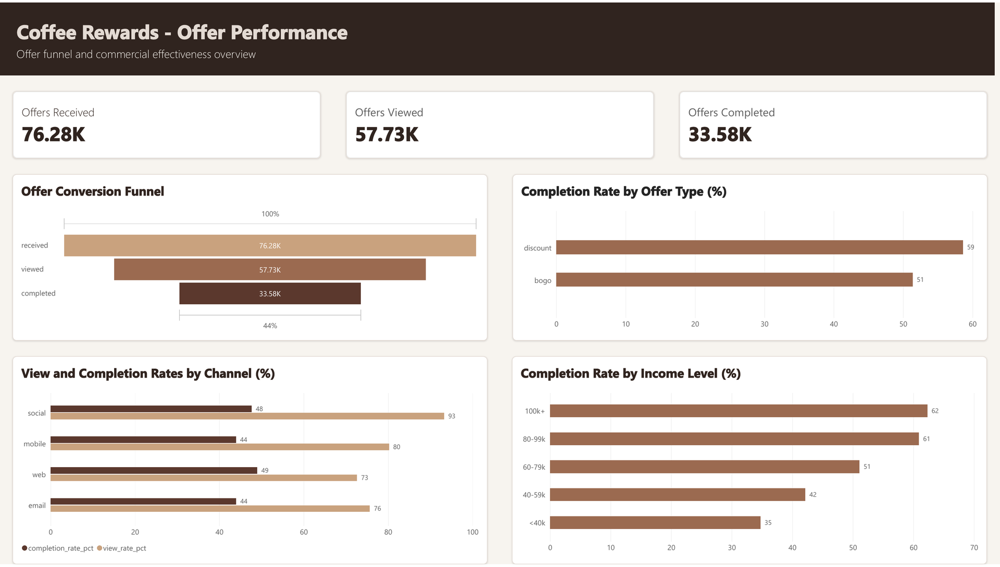
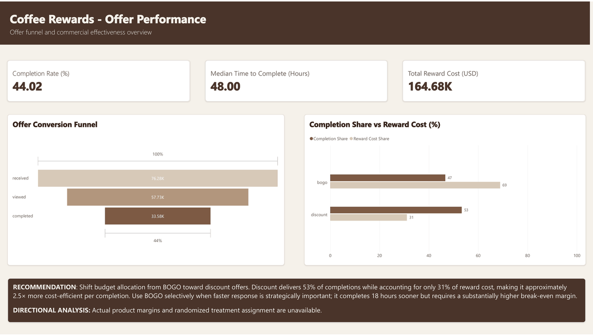
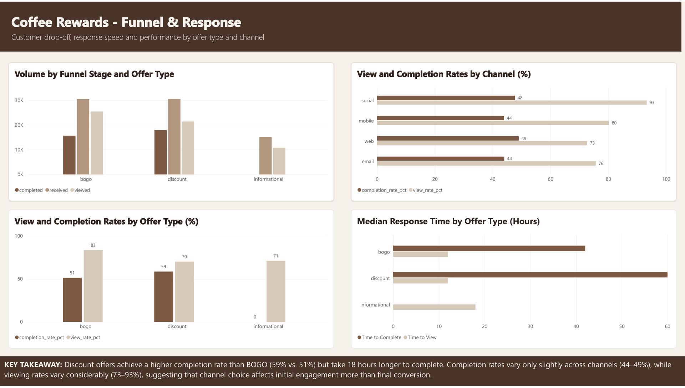
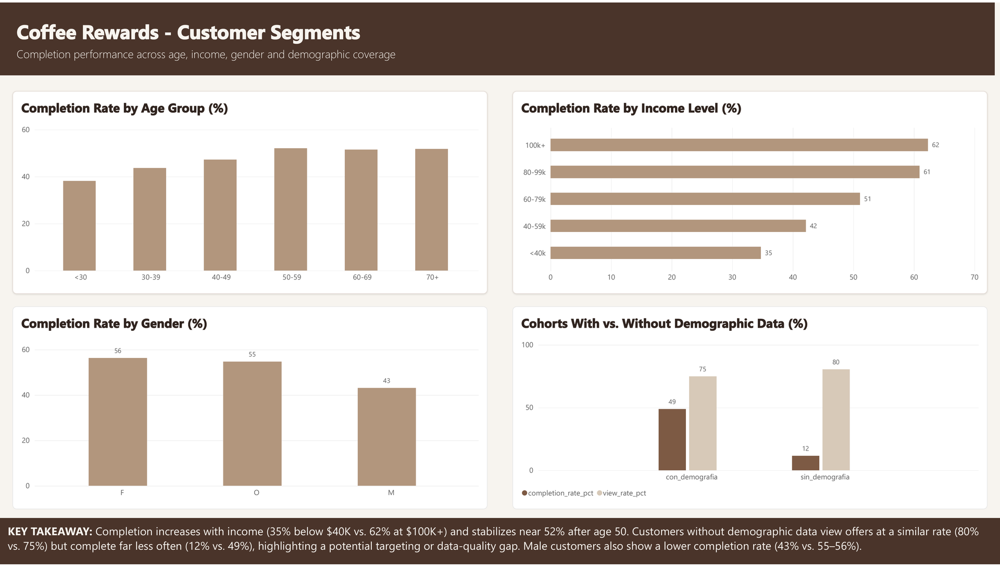
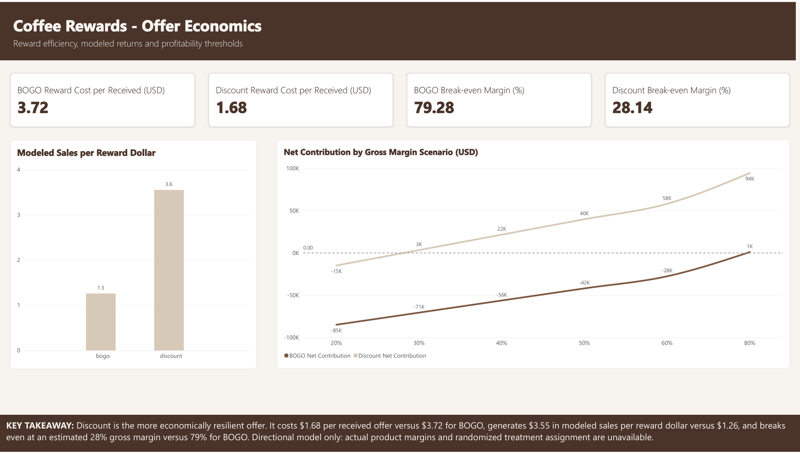

# Coffee Rewards - Offer Performance

An end-to-end marketing analytics project that evaluates how rewards members
receive, view, and complete promotional offers. The analysis combines Python,
SQL, and Power BI to identify conversion gaps, response speed, customer
segments, and the economic trade-offs between BOGO and discount incentives.



## Project overview

The dataset simulates 30 days of customer activity for a rewards program. It
contains 17,000 customers, 10 promotional offers, and 306,534 events covering
offer receipt, offer views, completions, and transactions.

The project answers nine business questions across four themes:

- Funnel performance and offer-type conversion
- Channel reach and customer response time
- Customer-segment performance and data coverage
- Reward efficiency and modeled profitability thresholds

## Executive summary

- **75.7% of received offers are viewed**, indicating strong program visibility.
- **44.0% of received offers are completed**, revealing the largest opportunity
  between viewing and redemption.
- **Discount offers lead completion at 58.6%**, while BOGO offers achieve the
  highest view rate at 83.4%.
- **Social leads visibility at 93.3%**, while web has the strongest completion
  rate at 49.0%.
- Completion increases with age and income: customers earning **$100k+ complete
  62.3%** of their offers, compared with **34.8%** for customers below $40k.
- Customers with missing demographics behave like a distinct anomalous cohort:
  they view offers frequently but complete only 11.6% and have a much lower
  average transaction value.
- A receipt-level journey analysis finds a median **12 hours to view** and
  **48 hours to complete** an offer.
- Discount offers account for **53.3% of completions but only 31.1% of reward
  cost**; BOGO accounts for 46.7% of completions and 68.9% of cost.
- Discount is approximately **2.5x more cost-efficient per completion** than
  BOGO based on stated reward value.
- A customer-and-time fixed-effects model estimates **$3.55 in sales per $1 of
  discount reward**, versus $1.26 for BOGO, after using informational offers as
  a behavioral benchmark. This is directional evidence, not causal ROI.

## Dashboard walkthrough

The final report contains four decision-oriented pages:

1. **Executive Summary** - business KPIs, the conversion funnel, reward-cost
   efficiency, and a visible recommendation.
2. **Funnel & Response** - funnel volume, offer and channel rates, and median
   response time by offer type.
3. **Customer Segments** - completion by age, income, and gender, plus the
   cohort with missing demographic data.
4. **Offer Economics** - reward cost, modeled sales per reward dollar,
   break-even margins, and gross-margin sensitivity.

[Download the final Power BI report as PDF](output/pdf/coffee-rewards-offer-performance.pdf).



<details>
<summary>View the individual report pages</summary>

### Executive Summary


### Funnel & Response



### Customer Segments



### Offer Economics



</details>

## Business questions and findings

| # | Business question | Key finding |
|---|---|---|
| 1 | What share of received offers are viewed? | 57,725 of 76,277 offers were viewed: **75.68%**. |
| 2 | What share of received offers are completed? | 33,579 offers were completed: **44.02%** of received offers. |
| 3 | Which offer type converts best? | **Discount** leads completion at 58.64%; BOGO leads views at 83.44%. |
| 4 | Which channel performs best? | **Social** leads view rate at 93.31%; **web** leads completion at 49.00%. |
| 5 | How quickly do customers respond? | Median time to view is **12 hours** and median time to complete is **48 hours** after matching events to individual receipt instances. |
| 6 | Do offers appear to increase spending and purchase frequency? | The fixed-effects estimate is +$1.56–$1.57 in daily spend and +0.12–0.14 daily transactions while an incentive is active; informational offers also show positive movement, so the result is not interpreted as causal lift. |
| 7 | Which demographic segments complete more offers? | Completion rises with age and income; women complete 56.4% versus 43.2% for men. |
| 8 | Does missing demographic data identify a different cohort? | Yes. The no-demographics cohort has 11.6% completion and a $2.70 average ticket. |
| 9 | How efficient is reward spending by offer type? | Completed offers incurred **$164,676 in stated reward value**. BOGO represents 68.9% of that cost but 46.7% of completions; discount represents 31.1% of cost and 53.3% of completions. |

## Incrementality and reward economics

The descriptive ticket comparison alone is not sufficient to estimate ROI.
Customers who view offers may already be more engaged, multiple offers can be
active at once, and the dataset does not identify a randomized control group.

To reduce those biases, the extended analysis uses two complementary checks:

1. A balanced six-hour customer panel compares each customer with themselves
   and controls for common time-period effects.
2. An isolated pre/post comparison retains only receipt windows without another
   overlapping offer and compares each active period with an equally long prior
   period.

The fixed-effects model produces the following directional estimates after
subtracting the informational-offer coefficient as a behavioral benchmark:

| Offer type | Estimated daily spend change | Estimated daily transaction change | Modeled sales per $1 reward | Break-even contribution margin |
|---|---:|---:|---:|---:|
| BOGO | +$0.82 | +0.064 | $1.26 | 79.3% |
| Discount | +$0.84 | +0.049 | $3.55 | 28.1% |

Discount is therefore the more economically plausible incentive in this
dataset: it converts more often, costs less per received offer ($1.68 versus
$3.72), and has a substantially lower modeled break-even margin. These results
are not a causal ROI claim because actual product margin and randomized
treatment assignment are unavailable.

Because actual gross margin is absent, the project also includes a scenario
analysis from 20% to 80%. Under the modeled incremental sales estimate,
discount becomes contribution-positive between 20% and 30% gross margin, while
BOGO does not cover its stated reward cost until approximately 79%.

## Analytical workflow

1. **Understand the source data** and validate schemas, event types, and nulls.
2. **Clean the customer, offer, and event tables** with Python and Pandas.
3. **Answer core funnel questions with SQL** and behavioral questions with
   Pandas.
4. **Create validated, pre-aggregated exports** for consistent Power BI metrics.
5. **Build and format the Power BI report** with an executive overview and
   focused detail pages.

## Repository structure

```text
coffee-rewards-offers/
├── dashboard/
│   ├── assets/                  # Final page PNGs and report walkthrough GIF
│   └── charts.md                # Power BI visual specification
├── data/
│   ├── raw/                     # Original source files
│   ├── processed/               # Cleaned analytical tables
│   └── export/                  # Validated Power BI-ready aggregates
├── notebooks/
│   ├── 01_data_understanding.ipynb
│   ├── 02_data_cleaning.ipynb
│   ├── 03_business_questions.ipynb
│   ├── 04_powerbi_export.py
│   └── 05_incrementality_analysis.py
├── sql/                         # Funnel and channel SQL queries
├── output/pdf/                  # Final exported Power BI report
├── requirements.txt
└── README.md
```

## Reproduce the analysis

Requirements: Python 3.10+.

```bash
# Install the analysis dependencies
python3 -m pip install -r requirements.txt

# Review and run the notebooks in order
jupyter notebook notebooks/01_data_understanding.ipynb
jupyter notebook notebooks/02_data_cleaning.ipynb
jupyter notebook notebooks/03_business_questions.ipynb

# Regenerate the Power BI-ready datasets
python3 notebooks/04_powerbi_export.py
python3 notebooks/05_incrementality_analysis.py
```

The generated files are written to `data/export/`. Import them into Power BI
using the visual mapping documented in [`dashboard/charts.md`](dashboard/charts.md).
The published portfolio report uses imported static data and an embedded
`AdditionalMetrics` table; it does not depend on a scheduled external data
connection.

## Tools

- **Power BI** - semantic model, report design, and portfolio presentation
- **Python / Pandas / NumPy** - cleaning, behavioral analysis, and exports
- **SQL / SQLite** - funnel, offer-type, and channel metrics
- **Jupyter Notebook** - reproducible exploratory analysis

## Assumptions and limitations

- Channel results use associative attribution: one offer may belong to multiple
  channels, so channel totals should not be added together.
- Informational offers have no completion event by design.
- Customers without demographic information are excluded from demographic
  segment comparisons and analyzed as a separate cohort.
- Spending comparisons are observational and should not be interpreted as
  causal uplift. The fixed-effects and isolated pre/post estimates reduce some
  observable bias but do not replace a randomized control group.
- The dataset does not contain product gross margin. Break-even margin is shown
  as the minimum contribution margin required for modeled incremental sales to
  cover the stated reward value; it is not realized profit.
- Informational offers are used only as a behavioral benchmark, not as a true
  experimental control group.

## Data source

[Cafe Rewards Offers - Maven Analytics](https://mavenanalytics.io/data-playground)
is a public-domain dataset originally sourced from Kaggle via Udacity.
