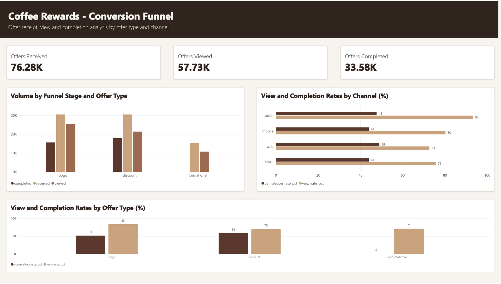
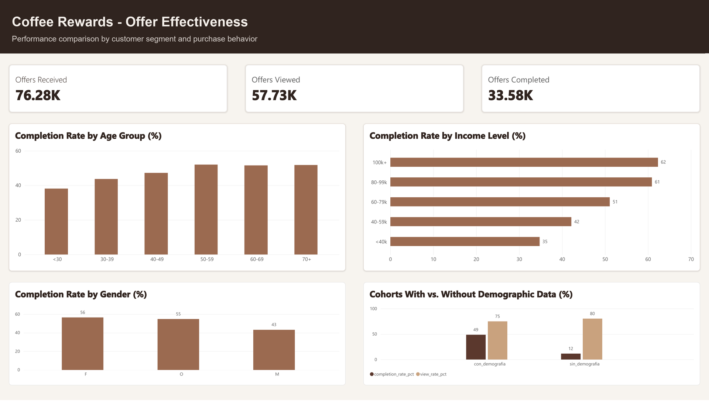
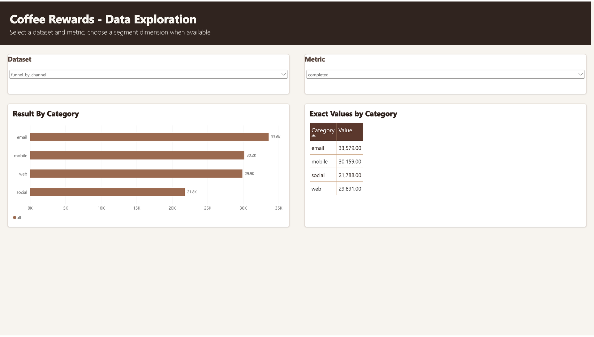

# Coffee Rewards - Offer Performance

An end-to-end marketing analytics project that evaluates how rewards members
receive, view, and complete promotional offers. The analysis combines Python,
SQL, and Power BI to identify conversion gaps, channel performance, customer
segments, and opportunities for more effective targeting.


## Project overview

The dataset simulates 30 days of customer activity for a rewards program. It
contains 17,000 customers, 10 promotional offers, and 306,534 events covering
offer receipt, offer views, completions, and transactions.

The project answers nine business questions across four themes:

- Funnel performance and offer-type conversion
- Channel reach and effectiveness
- Customer response time and spending behavior
- Demographic performance and reward cost

## Executive summary

- **75.7% of received offers are viewed**, indicating strong program visibility.
- **44.0% of received offers are completed**, revealing the largest opportunity
  between viewing and redemption.
- **Discount offers lead completion at 58.6%**, while BOGO offers achieve the
  highest view rate at 83.4%.
- **Social leads visibility at 93.3%**, while web has the strongest completion
  rate at 49.0%.
- Completion increases with age and income: customers earning **$100k+ complete
  62.3%** of their offers, compared with **34.8%** for customers below $40k.
- Customers with missing demographics behave like a distinct anomalous cohort:
  they view offers frequently but complete only 11.6% and have a much lower
  average transaction value.
- Viewed offers are associated with only a **$0.12 increase in average ticket**;
  this descriptive result does not establish causal lift.

## Dashboard walkthrough

The report contains four pages: an executive dashboard, funnel analysis,
customer effectiveness analysis, and an interactive data-exploration page.


<details>
<summary>View the individual report pages</summary>

### Funnel Analysis



### Effectiveness Analysis



### Data Exploration



</details>

## Business questions and findings

| # | Business question | Key finding |
|---|---|---|
| 1 | What share of received offers are viewed? | 57,725 of 76,277 offers were viewed: **75.68%**. |
| 2 | What share of received offers are completed? | 33,579 offers were completed: **44.02%** of received offers. |
| 3 | Which offer type converts best? | **Discount** leads completion at 58.64%; BOGO leads views at 83.44%. |
| 4 | Which channel performs best? | **Social** leads view rate at 93.31%; **web** leads completion at 49.00%. |
| 5 | How quickly do customers respond? | Median time to view is 18 hours; median time to complete is 54 hours. |
| 6 | Do viewed offers increase basket size? | Average ticket changes from $12.76 without an active offer to $12.88 after a viewed offer. |
| 7 | Which demographic segments complete more offers? | Completion rises with age and income; women complete 56.4% versus 43.2% for men. |
| 8 | Does missing demographic data identify a different cohort? | Yes. The no-demographics cohort has 11.6% completion and a $2.70 average ticket. |
| 9 | What is the economic value of issued rewards? | Completed offers generated **$164,676** in rewards; BOGO represents 69% of that cost. |

## Analytical workflow

1. **Understand the source data** and validate schemas, event types, and nulls.
2. **Clean the customer, offer, and event tables** with Python and Pandas.
3. **Answer core funnel questions with SQL** and behavioral questions with
   Pandas.
4. **Create validated, pre-aggregated exports** for consistent Power BI metrics.
5. **Build and format the Power BI report** with an executive overview and
   focused detail pages.

## Repository structure

```text
coffee-rewards-offers/
├── dashboard/
│   ├── assets/                  # Dashboard PNGs and report walkthrough GIF
│   └── charts.md                # Power BI visual specification
├── data/
│   ├── raw/                     # Original source files
│   ├── processed/               # Cleaned analytical tables
│   └── export/                  # Validated Power BI-ready aggregates
├── notebooks/
│   ├── 01_data_understanding.ipynb
│   ├── 02_data_cleaning.ipynb
│   ├── 03_business_questions.ipynb
│   └── 04_powerbi_export.py
├── sql/                         # Funnel and channel SQL queries
├── requirements.txt
└── README.md
```

## Reproduce the analysis

Requirements: Python 3.10+.

```bash
# Install the analysis dependencies
python3 -m pip install -r requirements.txt

# Review and run the notebooks in order
jupyter notebook notebooks/01_data_understanding.ipynb
jupyter notebook notebooks/02_data_cleaning.ipynb
jupyter notebook notebooks/03_business_questions.ipynb

# Regenerate the Power BI-ready datasets
python3 notebooks/04_powerbi_export.py
```

The generated files are written to `data/export/`. Import them into Power BI
using the visual mapping documented in [`dashboard/charts.md`](dashboard/charts.md).

## Tools

- **Power BI** - dashboard design and interactive exploration
- **Python / Pandas / NumPy** - cleaning, behavioral analysis, and exports
- **SQL / SQLite** - funnel, offer-type, and channel metrics
- **Jupyter Notebook** - reproducible exploratory analysis

## Assumptions and limitations

- Channel results use associative attribution: one offer may belong to multiple
  channels, so channel totals should not be added together.
- Informational offers have no completion event by design.
- Customers without demographic information are excluded from demographic
  segment comparisons and analyzed as a separate cohort.
- Spending comparisons are observational and should not be interpreted as
  causal uplift. A controlled experiment would be required for ROI estimation.

## Data source

[Cafe Rewards Offers - Maven Analytics](https://mavenanalytics.io/data-playground)
is a public-domain dataset originally sourced from Kaggle via Udacity.
